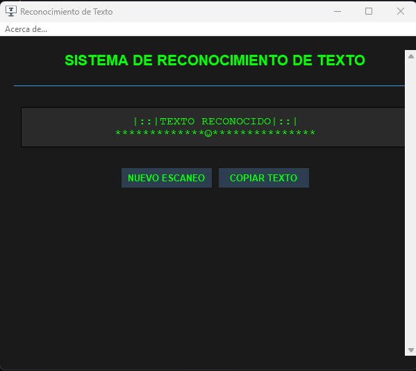
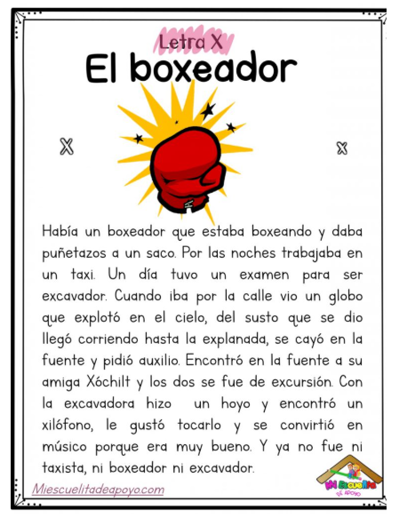
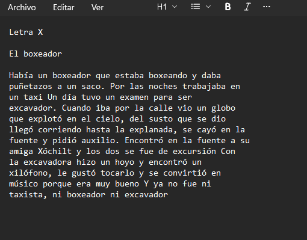

# 🖼️ Recortador de Texto para Windows 10

Una herramienta simple pero poderosa desarrollada en Python que permite **extraer texto de capturas de pantalla** directamente, emulando la función moderna de "Copiar texto de la captura" de Windows 11.

Ideal para entornos donde se necesita copiar información desde documentos escaneados, pantallas o aplicaciones que no permiten seleccionar texto.


---

## 📋 Tabla de Contenidos

- [Características](#-características)
- [Requisitos](#-requisitos)
- [Instalación](#-instalación)
- [Uso](#-uso)
- [Ejemplos](#-ejemplos)
- [Estructura del Proyecto](#-estructura-del-proyecto)
- [Dependencias](#️-dependencias)
- [Contribuir](#-contribuir)
- [Autor](#-autor)
- [Licencia](#-licencia)

---

## 🚀 Características

✨ **Funcionalidades principales:**

- 📸 Captura una región de la pantalla y extrae el texto automáticamente
- 🎨 Interfaz sencilla con **Tkinter** y diseño futurista oscuro
- 📋 Copia el texto reconocido directamente al portapapeles
- 🔒 Funciona **sin conexión a Internet**
- 🎯 Utiliza **Tesseract OCR** embebido en el proyecto (no requiere instalación global)
- ⚡ Rápido y ligero
- 🌐 Soporte para múltiples idiomas (español e inglés por defecto)

---

## 🧰 Requisitos

| Requisito | Versión Mínima |
|-----------|----------------|
| Sistema Operativo | Windows 10 u 11 |
| Python | 3.8+ |
| RAM | 2 GB |
| Espacio en Disco | 100 MB |

---

## 📦 Instalación

### Opción 1: Instalación Estándar

1. **Clona este repositorio:**
```bash
   git clone https://github.com/Juan2400/Recortador-Texto-Win10.git
```

2. **Entra en el directorio del proyecto:**
```bash
   cd Recortador-Texto-Win10
```

3. **Crea un entorno virtual (recomendado):**
```bash
   python -m venv venv
   venv\Scripts\activate
```

4. **Instala las dependencias:**
```bash
   pip install -r requirements.txt
```

5. **Ejecuta el programa:**
```bash
   python Recortador_Texto.py
```

### Opción 2: Ejecutable Portable (próximamente)

Se planea incluir un archivo `.exe` compilado para usuarios que no tengan Python instalado.

---

## 🧠 Uso

### Guía Rápida

1. **Inicia el programa** ejecutando `Recortador_Texto.py`
2. **Haz clic en "NUEVO ESCANEO"**
3. **Selecciona con el ratón** el área de la pantalla donde está el texto
4. **Espera unos segundos** mientras el programa reconoce el contenido
5. **Copia el texto** usando el botón correspondiente
   
---

## 📸 Ejemplos

### Interfaz Principal


### Texto a capturar 


### Resultado del OCR


### Copia y pega del texto


---

## 📁 Estructura del Proyecto
```
Recortador-Texto-Win10/
│
├── Recortador_Texto.py      # Código principal del programa
├── texto.ico                # Ícono de la aplicación
├── requirements.txt         # Dependencias Python
├── README.md               # Este archivo
├── LICENSE                 # Archivo de licencia MIT
├── .gitignore             # Archivos excluidos de Git
├── Tesseract-OCR/         # Motor OCR embebido
└── screenshots/           # Imágenes demostrativas
```

---

## ⚙️ Dependencias

El proyecto utiliza las siguientes bibliotecas Python:
```txt
pytesseract==0.3.10    # Wrapper de Python para Tesseract OCR
pyautogui==0.9.54      # Captura de pantalla y automatización
Pillow==10.0.0         # Procesamiento de imágenes
pyperclip==1.8.2       # Gestión del portapapeles
```

### Instalación manual de dependencias:
```bash
pip install pytesseract pyautogui Pillow pyperclip
```

> **Nota:** `tkinter` viene incluido con la instalación estándar de Python en Windows.


## 🤝 Contribuir

¡Las contribuciones son bienvenidas! Si quieres mejorar este proyecto:

1. **Fork** el repositorio
2. Crea una **rama** para tu función (`git checkout -b feature/nueva-funcion`)
3. **Commit** tus cambios (`git commit -m 'Añade nueva función'`)
4. **Push** a la rama (`git push origin feature/nueva-funcion`)
5. Abre un **Pull Request**

### Ideas para Contribuir

- 🌍 Añadir soporte para más idiomas
- 🎨 Mejorar la interfaz gráfica
- 📊 Implementar estadísticas de uso
- 🔊 Agregar lectura en voz alta del texto reconocido
- 📱 Crear versión para Linux/Mac

---

## 🧑‍💻 Autor

**Juan**

💡 Desarrollador autodidacta apasionado por la automatización y la productividad en Windows.

- 🌐 [Sitio Web](#) 
- 📧 [Email](#)
- 💼 [LinkedIn](#) 
- 🐙 [GitHub](https://github.com/Juan2400)

---

## 📜 Licencia

Este proyecto se distribuye bajo la licencia **MIT**, lo que permite su libre uso y modificación con atribución al autor original.

Ver el archivo [LICENSE](LICENSE) para más detalles.

---

## 💬 Historia del Proyecto

Este proyecto nació como una herramienta personal en mi trabajo de digitalización de documentos, donde necesitaba copiar rápidamente texto desde capturas sin depender de servicios web externos o actualizar a Windows 11.

La frustración de no poder seleccionar texto en PDFs escaneados, imágenes o aplicaciones legacy me llevó a crear esta solución simple pero efectiva.

---

## ⭐ Agradecimientos

- Al equipo de **Tesseract OCR** por su increíble motor de reconocimiento
- A la comunidad de **Python** por las excelentes bibliotecas disponibles
- A todos los que usen y mejoren esta herramienta

---

## 📊 Estado del Proyecto

- ✅ Funcionalidad básica de OCR
- ✅ Interfaz gráfica con Tkinter
- ✅ Soporte para español e inglés
- 🔄 En desarrollo: Versión ejecutable standalone
- 📋 Planificado: Historial de capturas
- 📋 Planificado: Exportación a diferentes formatos

---

<div align="center">

**Si este proyecto te resulta útil, ¡no dudes en dejar una ⭐ en el repositorio!**

[⬆ Volver arriba](#️-recortador-de-texto-para-windows-10)

</div>
